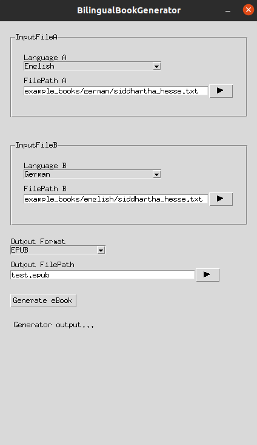

# BilingualBookGenerator

Tool for generating Bilingual Books, where sentences in language A are matched to sentences in language B. The tool uses Tensorflow's universal-sentence-encoder-multilingual model to match sentences between the 16 supported languages.

**Supported languages**:

* Arabic
* Chinese-simplified
* Chinese-traditional
* English
* French
* German
* Italian
* Japanese
* Korean
* Dutch
* Polish
* Portuguese
* Spanish
* Thai
* Turkish
* Russian

**Experimental Language Support**

Matching unsupported languages is done using Google Translate's API. This feature is still experimental, Google Translate API is changing rapidly, which can easily break the solution. Since communication is needed with the GoogleTranslate servers, matching in these languages is also significantly slower.

**Supported output formats**:
* .txt
* .rtf

**Supported output formats**:
* .epub

<ins>*Note*</ins>: EPUB files can be converted to different formats by using e.g. [Calibre](https://calibre-ebook.com/).

## Usage

1. Select an ebook and its translation. Make sure their input formats are supported. Select the language of the ebooks.
2. Select the output format for the generated bilingual ebook
3. Click the generate button. The book generation will take some time. Please be patient.

##Sources of Free eBooks 
https://www.gutenberg.org/ 
https://archive.org/details/texts?tab=about 
Hungarian books: https://mek.oszk.hu/

## Generated eBook Examples

[Siddhartha by Herman Hesse, German-English EPUB](example_books/generated/siddhartha_hesse_de_en.epub)

## Other

Jupyter notebook of the initial experiments: [Notebook](experiments/BilingualBookGeneratorCleaned.ipynb)